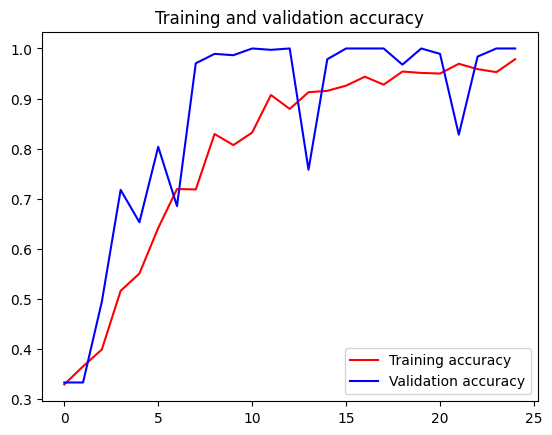

# 1. TFLite模型生成
## 1.1 预备工作
### 安装程序运行必备的库


```python
%pip install tflite-model-maker
```

    Requirement already satisfied: tflite-model-maker in /workspaces/mobileLearning/.conda/lib/python3.8/site-packages (0.4.3)
    Requirement already satisfied: tf-models-official==2.3.0 in /workspaces/mobileLearning/.conda/lib/python3.8/site-packages (from tflite-model-maker) (2.3.0)
    Requirement already satisfied: numpy<1.23.4,>=1.17.3 in /workspaces/mobileLearning/.conda/lib/python3.8/site-packages (from tflite-model-maker) (1.23.3)
    Requirement already satisfied: pillow>=7.0.0 in /workspaces/mobileLearning/.conda/lib/python3.8/site-packages (from tflite-model-maker) (10.3.0)
    Requirement already satisfied: sentencepiece>=0.1.91 in /workspaces/mobileLearning/.conda/lib/python3.8/site-packages (from tflite-model-maker) (0.2.0)
    Requirement already satisfied: tensorflow-datasets>=2.1.0 in /workspaces/mobileLearning/.conda/lib/python3.8/site-packages (from tflite-model-maker) (4.9.0)
    Requirement already satisfied: fire>=0.3.1 in /workspaces/mobileLearning/.conda/lib/python3.8/site-packages (from tflite-model-maker) (0.6.0)
    Requirement already satisfied: flatbuffers>=2.0 in /workspaces/mobileLearning/.conda/lib/python3.8/site-packages (from tflite-model-maker) (24.3.25)
    Requirement already satisfied: absl-py>=0.10.0 in /workspaces/mobileLearning/.conda/lib/python3.8/site-packages (from tflite-model-maker) (1.4.0)
    Requirement already satisfied: urllib3!=1.25.0,!=1.25.1,<1.26,>=1.21.1 in /workspaces/mobileLearning/.conda/lib/python3.8/site-packages (from tflite-model-maker) (1.25.11)
    Requirement already satisfied: tflite-support>=0.4.2 in /workspaces/mobileLearning/.conda/lib/python3.8/site-packages (from tflite-model-maker) (0.4.3)
    Requirement already satisfied: tensorflowjs<3.19.0,>=2.4.0 in /workspaces/mobileLearning/.conda/lib/python3.8/site-packages (from tflite-model-maker) (3.18.0)
    Requirement already satisfied: tensorflow>=2.6.0 in /workspaces/mobileLearning/.conda/lib/python3.8/site-packages (from tflite-model-maker) (2.8.4)
    Requirement already satisfied: numba>=0.53 in /workspaces/mobileLearning/.conda/lib/python3.8/site-packages (from tflite-model-maker) (0.58.1)
    Requirement already satisfied: librosa==0.8.1 in /workspaces/mobileLearning/.conda/lib/python3.8/site-packages (from tflite-model-maker) (0.8.1)
    Requirement already satisfied: lxml>=4.6.1 in /workspaces/mobileLearning/.conda/lib/python3.8/site-packages (from tflite-model-maker) (5.2.2)
    Requirement already satisfied: PyYAML>=5.1 in /workspaces/mobileLearning/.conda/lib/python3.8/site-packages (from tflite-model-maker) (6.0.1)
    Requirement already satisfied: matplotlib<3.5.0,>=3.0.3 in /workspaces/mobileLearning/.conda/lib/python3.8/site-packages (from tflite-model-maker) (3.4.3)
    Requirement already satisfied: six>=1.12.0 in /workspaces/mobileLearning/.conda/lib/python3.8/site-packages (from tflite-model-maker) (1.16.0)
    Requirement already satisfied: tensorflow-addons>=0.11.2 in /workspaces/mobileLearning/.conda/lib/python3.8/site-packages (from tflite-model-maker) (0.21.0)
    Requirement already satisfied: neural-structured-learning>=1.3.1 in /workspaces/mobileLearning/.conda/lib/python3.8/site-packages (from tflite-model-maker) (1.4.0)
    Requirement already satisfied: tensorflow-model-optimization>=0.5 in /workspaces/mobileLearning/.conda/lib/python3.8/site-packages (from tflite-model-maker) (0.8.0)
    Requirement already satisfied: Cython>=0.29.13 in /workspaces/mobileLearning/.conda/lib/python3.8/site-packages (from tflite-model-maker) (3.0.10)
    Requirement already satisfied: scann==1.2.6 in /workspaces/mobileLearning/.conda/lib/python3.8/site-packages (from tflite-model-maker) (1.2.6)
    Requirement already satisfied: tensorflow-hub<0.13,>=0.7.0 in /workspaces/mobileLearning/.conda/lib/python3.8/site-packages (from tflite-model-maker) (0.12.0)
    Requirement already satisfied: audioread>=2.0.0 in /workspaces/mobileLearning/.conda/lib/python3.8/site-packages (from librosa==0.8.1->tflite-model-maker) (3.0.1)
    Requirement already satisfied: scipy>=1.0.0 in /workspaces/mobileLearning/.conda/lib/python3.8/site-packages (from librosa==0.8.1->tflite-model-maker) (1.10.1)
    Requirement already satisfied: scikit-learn!=0.19.0,>=0.14.0 in /workspaces/mobileLearning/.conda/lib/python3.8/site-packages (from librosa==0.8.1->tflite-model-maker) (1.3.2)
    Requirement already satisfied: joblib>=0.14 in /workspaces/mobileLearning/.conda/lib/python3.8/site-packages (from librosa==0.8.1->tflite-model-maker) (1.4.2)
    Requirement already satisfied: decorator>=3.0.0 in /workspaces/mobileLearning/.conda/lib/python3.8/site-packages (from librosa==0.8.1->tflite-model-maker) (5.1.1)
    Requirement already satisfied: resampy>=0.2.2 in /workspaces/mobileLearning/.conda/lib/python3.8/site-packages (from librosa==0.8.1->tflite-model-maker) (0.4.3)
    Requirement already satisfied: soundfile>=0.10.2 in /workspaces/mobileLearning/.conda/lib/python3.8/site-packages (from librosa==0.8.1->tflite-model-maker) (0.12.1)
    Requirement already satisfied: pooch>=1.0 in /workspaces/mobileLearning/.conda/lib/python3.8/site-packages (from librosa==0.8.1->tflite-model-maker) (1.8.2)
    Requirement already satisfied: packaging>=20.0 in /workspaces/mobileLearning/.conda/lib/python3.8/site-packages (from librosa==0.8.1->tflite-model-maker) (20.9)
    Requirement already satisfied: dataclasses in /workspaces/mobileLearning/.conda/lib/python3.8/site-packages (from tf-models-official==2.3.0->tflite-model-maker) (0.6)
    Requirement already satisfied: gin-config in /workspaces/mobileLearning/.conda/lib/python3.8/site-packages (from tf-models-official==2.3.0->tflite-model-maker) (0.5.0)
    Requirement already satisfied: google-api-python-client>=1.6.7 in /workspaces/mobileLearning/.conda/lib/python3.8/site-packages (from tf-models-official==2.3.0->tflite-model-maker) (2.133.0)
    Requirement already satisfied: google-cloud-bigquery>=0.31.0 in /workspaces/mobileLearning/.conda/lib/python3.8/site-packages (from tf-models-official==2.3.0->tflite-model-maker) (3.24.0)
    Requirement already satisfied: kaggle>=1.3.9 in /workspaces/mobileLearning/.conda/lib/python3.8/site-packages (from tf-models-official==2.3.0->tflite-model-maker) (1.6.14)
    Requirement already satisfied: opencv-python-headless in /workspaces/mobileLearning/.conda/lib/python3.8/site-packages (from tf-models-official==2.3.0->tflite-model-maker) (4.10.0.82)
    Requirement already satisfied: pandas>=0.22.0 in /workspaces/mobileLearning/.conda/lib/python3.8/site-packages (from tf-models-official==2.3.0->tflite-model-maker) (2.0.3)
    Requirement already satisfied: psutil>=5.4.3 in /workspaces/mobileLearning/.conda/lib/python3.8/site-packages (from tf-models-official==2.3.0->tflite-model-maker) (5.9.8)
    Requirement already satisfied: py-cpuinfo>=3.3.0 in /workspaces/mobileLearning/.conda/lib/python3.8/site-packages (from tf-models-official==2.3.0->tflite-model-maker) (9.0.0)
    Requirement already satisfied: tf-slim>=1.1.0 in /workspaces/mobileLearning/.conda/lib/python3.8/site-packages (from tf-models-official==2.3.0->tflite-model-maker) (1.1.0)
    Requirement already satisfied: termcolor in /workspaces/mobileLearning/.conda/lib/python3.8/site-packages (from fire>=0.3.1->tflite-model-maker) (2.4.0)
    Requirement already satisfied: cycler>=0.10 in /workspaces/mobileLearning/.conda/lib/python3.8/site-packages (from matplotlib<3.5.0,>=3.0.3->tflite-model-maker) (0.12.1)
    Requirement already satisfied: kiwisolver>=1.0.1 in /workspaces/mobileLearning/.conda/lib/python3.8/site-packages (from matplotlib<3.5.0,>=3.0.3->tflite-model-maker) (1.4.5)
    Requirement already satisfied: pyparsing>=2.2.1 in /workspaces/mobileLearning/.conda/lib/python3.8/site-packages (from matplotlib<3.5.0,>=3.0.3->tflite-model-maker) (3.1.2)
    Requirement already satisfied: python-dateutil>=2.7 in /workspaces/mobileLearning/.conda/lib/python3.8/site-packages (from matplotlib<3.5.0,>=3.0.3->tflite-model-maker) (2.9.0)
    Requirement already satisfied: attrs in /workspaces/mobileLearning/.conda/lib/python3.8/site-packages (from neural-structured-learning>=1.3.1->tflite-model-maker) (23.2.0)
    Requirement already satisfied: llvmlite<0.42,>=0.41.0dev0 in /workspaces/mobileLearning/.conda/lib/python3.8/site-packages (from numba>=0.53->tflite-model-maker) (0.41.1)
    Requirement already satisfied: importlib-metadata in /workspaces/mobileLearning/.conda/lib/python3.8/site-packages (from numba>=0.53->tflite-model-maker) (7.1.0)
    Requirement already satisfied: astunparse>=1.6.0 in /workspaces/mobileLearning/.conda/lib/python3.8/site-packages (from tensorflow>=2.6.0->tflite-model-maker) (1.6.3)
    Requirement already satisfied: gast>=0.2.1 in /workspaces/mobileLearning/.conda/lib/python3.8/site-packages (from tensorflow>=2.6.0->tflite-model-maker) (0.5.4)
    Requirement already satisfied: google-pasta>=0.1.1 in /workspaces/mobileLearning/.conda/lib/python3.8/site-packages (from tensorflow>=2.6.0->tflite-model-maker) (0.2.0)
    Requirement already satisfied: h5py>=2.9.0 in /workspaces/mobileLearning/.conda/lib/python3.8/site-packages (from tensorflow>=2.6.0->tflite-model-maker) (3.11.0)
    Requirement already satisfied: keras-preprocessing>=1.1.1 in /workspaces/mobileLearning/.conda/lib/python3.8/site-packages (from tensorflow>=2.6.0->tflite-model-maker) (1.1.2)
    Requirement already satisfied: libclang>=9.0.1 in /workspaces/mobileLearning/.conda/lib/python3.8/site-packages (from tensorflow>=2.6.0->tflite-model-maker) (18.1.1)
    Requirement already satisfied: opt-einsum>=2.3.2 in /workspaces/mobileLearning/.conda/lib/python3.8/site-packages (from tensorflow>=2.6.0->tflite-model-maker) (3.3.0)
    Requirement already satisfied: protobuf<3.20,>=3.9.2 in /workspaces/mobileLearning/.conda/lib/python3.8/site-packages (from tensorflow>=2.6.0->tflite-model-maker) (3.19.6)
    Requirement already satisfied: setuptools in /workspaces/mobileLearning/.conda/lib/python3.8/site-packages (from tensorflow>=2.6.0->tflite-model-maker) (70.0.0)
    Requirement already satisfied: typing-extensions>=3.6.6 in /workspaces/mobileLearning/.conda/lib/python3.8/site-packages (from tensorflow>=2.6.0->tflite-model-maker) (4.12.2)
    Requirement already satisfied: wrapt>=1.11.0 in /workspaces/mobileLearning/.conda/lib/python3.8/site-packages (from tensorflow>=2.6.0->tflite-model-maker) (1.16.0)
    Requirement already satisfied: tensorboard<2.9,>=2.8 in /workspaces/mobileLearning/.conda/lib/python3.8/site-packages (from tensorflow>=2.6.0->tflite-model-maker) (2.8.0)
    Requirement already satisfied: tensorflow-estimator<2.9,>=2.8 in /workspaces/mobileLearning/.conda/lib/python3.8/site-packages (from tensorflow>=2.6.0->tflite-model-maker) (2.8.0)
    Requirement already satisfied: keras<2.9,>=2.8.0rc0 in /workspaces/mobileLearning/.conda/lib/python3.8/site-packages (from tensorflow>=2.6.0->tflite-model-maker) (2.8.0)
    Requirement already satisfied: tensorflow-io-gcs-filesystem>=0.23.1 in /workspaces/mobileLearning/.conda/lib/python3.8/site-packages (from tensorflow>=2.6.0->tflite-model-maker) (0.34.0)
    Requirement already satisfied: grpcio<2.0,>=1.24.3 in /workspaces/mobileLearning/.conda/lib/python3.8/site-packages (from tensorflow>=2.6.0->tflite-model-maker) (1.64.1)
    Requirement already satisfied: typeguard<3.0.0,>=2.7 in /workspaces/mobileLearning/.conda/lib/python3.8/site-packages (from tensorflow-addons>=0.11.2->tflite-model-maker) (2.13.3)
    Requirement already satisfied: array-record in /workspaces/mobileLearning/.conda/lib/python3.8/site-packages (from tensorflow-datasets>=2.1.0->tflite-model-maker) (0.4.0)
    Requirement already satisfied: click in /workspaces/mobileLearning/.conda/lib/python3.8/site-packages (from tensorflow-datasets>=2.1.0->tflite-model-maker) (8.1.7)
    Requirement already satisfied: dm-tree in /workspaces/mobileLearning/.conda/lib/python3.8/site-packages (from tensorflow-datasets>=2.1.0->tflite-model-maker) (0.1.8)
    Requirement already satisfied: etils>=0.9.0 in /workspaces/mobileLearning/.conda/lib/python3.8/site-packages (from etils[enp,epath]>=0.9.0->tensorflow-datasets>=2.1.0->tflite-model-maker) (1.3.0)
    Requirement already satisfied: promise in /workspaces/mobileLearning/.conda/lib/python3.8/site-packages (from tensorflow-datasets>=2.1.0->tflite-model-maker) (2.3)
    Requirement already satisfied: requests>=2.19.0 in /workspaces/mobileLearning/.conda/lib/python3.8/site-packages (from tensorflow-datasets>=2.1.0->tflite-model-maker) (2.32.3)
    Requirement already satisfied: tensorflow-metadata in /workspaces/mobileLearning/.conda/lib/python3.8/site-packages (from tensorflow-datasets>=2.1.0->tflite-model-maker) (1.13.0)
    Requirement already satisfied: toml in /workspaces/mobileLearning/.conda/lib/python3.8/site-packages (from tensorflow-datasets>=2.1.0->tflite-model-maker) (0.10.2)
    Requirement already satisfied: tqdm in /workspaces/mobileLearning/.conda/lib/python3.8/site-packages (from tensorflow-datasets>=2.1.0->tflite-model-maker) (4.66.4)
    Requirement already satisfied: importlib-resources in /workspaces/mobileLearning/.conda/lib/python3.8/site-packages (from tensorflow-datasets>=2.1.0->tflite-model-maker) (6.4.0)
    Requirement already satisfied: sounddevice>=0.4.4 in /workspaces/mobileLearning/.conda/lib/python3.8/site-packages (from tflite-support>=0.4.2->tflite-model-maker) (0.4.7)
    Requirement already satisfied: pybind11>=2.6.0 in /workspaces/mobileLearning/.conda/lib/python3.8/site-packages (from tflite-support>=0.4.2->tflite-model-maker) (2.12.0)
    Requirement already satisfied: wheel<1.0,>=0.23.0 in /workspaces/mobileLearning/.conda/lib/python3.8/site-packages (from astunparse>=1.6.0->tensorflow>=2.6.0->tflite-model-maker) (0.43.0)
    Requirement already satisfied: zipp in /workspaces/mobileLearning/.conda/lib/python3.8/site-packages (from etils[enp,epath]>=0.9.0->tensorflow-datasets>=2.1.0->tflite-model-maker) (3.19.2)
    Requirement already satisfied: httplib2<1.dev0,>=0.19.0 in /workspaces/mobileLearning/.conda/lib/python3.8/site-packages (from google-api-python-client>=1.6.7->tf-models-official==2.3.0->tflite-model-maker) (0.22.0)
    Requirement already satisfied: google-auth!=2.24.0,!=2.25.0,<3.0.0.dev0,>=1.32.0 in /workspaces/mobileLearning/.conda/lib/python3.8/site-packages (from google-api-python-client>=1.6.7->tf-models-official==2.3.0->tflite-model-maker) (2.30.0)
    Requirement already satisfied: google-auth-httplib2<1.0.0,>=0.2.0 in /workspaces/mobileLearning/.conda/lib/python3.8/site-packages (from google-api-python-client>=1.6.7->tf-models-official==2.3.0->tflite-model-maker) (0.2.0)
    Requirement already satisfied: google-api-core!=2.0.*,!=2.1.*,!=2.2.*,!=2.3.0,<3.0.0.dev0,>=1.31.5 in /workspaces/mobileLearning/.conda/lib/python3.8/site-packages (from google-api-python-client>=1.6.7->tf-models-official==2.3.0->tflite-model-maker) (2.19.0)
    Requirement already satisfied: uritemplate<5,>=3.0.1 in /workspaces/mobileLearning/.conda/lib/python3.8/site-packages (from google-api-python-client>=1.6.7->tf-models-official==2.3.0->tflite-model-maker) (4.1.1)
    Requirement already satisfied: google-cloud-core<3.0.0dev,>=1.6.0 in /workspaces/mobileLearning/.conda/lib/python3.8/site-packages (from google-cloud-bigquery>=0.31.0->tf-models-official==2.3.0->tflite-model-maker) (2.4.1)
    Requirement already satisfied: google-resumable-media<3.0dev,>=0.6.0 in /workspaces/mobileLearning/.conda/lib/python3.8/site-packages (from google-cloud-bigquery>=0.31.0->tf-models-official==2.3.0->tflite-model-maker) (2.7.1)
    Requirement already satisfied: certifi>=2023.7.22 in /workspaces/mobileLearning/.conda/lib/python3.8/site-packages (from kaggle>=1.3.9->tf-models-official==2.3.0->tflite-model-maker) (2024.6.2)
    Requirement already satisfied: python-slugify in /workspaces/mobileLearning/.conda/lib/python3.8/site-packages (from kaggle>=1.3.9->tf-models-official==2.3.0->tflite-model-maker) (8.0.4)
    Requirement already satisfied: bleach in /workspaces/mobileLearning/.conda/lib/python3.8/site-packages (from kaggle>=1.3.9->tf-models-official==2.3.0->tflite-model-maker) (6.1.0)
    Requirement already satisfied: pytz>=2020.1 in /workspaces/mobileLearning/.conda/lib/python3.8/site-packages (from pandas>=0.22.0->tf-models-official==2.3.0->tflite-model-maker) (2024.1)
    Requirement already satisfied: tzdata>=2022.1 in /workspaces/mobileLearning/.conda/lib/python3.8/site-packages (from pandas>=0.22.0->tf-models-official==2.3.0->tflite-model-maker) (2024.1)
    Requirement already satisfied: platformdirs>=2.5.0 in /workspaces/mobileLearning/.conda/lib/python3.8/site-packages (from pooch>=1.0->librosa==0.8.1->tflite-model-maker) (4.2.2)
    Requirement already satisfied: charset-normalizer<4,>=2 in /workspaces/mobileLearning/.conda/lib/python3.8/site-packages (from requests>=2.19.0->tensorflow-datasets>=2.1.0->tflite-model-maker) (3.3.2)
    Requirement already satisfied: idna<4,>=2.5 in /workspaces/mobileLearning/.conda/lib/python3.8/site-packages (from requests>=2.19.0->tensorflow-datasets>=2.1.0->tflite-model-maker) (3.7)
    Requirement already satisfied: threadpoolctl>=2.0.0 in /workspaces/mobileLearning/.conda/lib/python3.8/site-packages (from scikit-learn!=0.19.0,>=0.14.0->librosa==0.8.1->tflite-model-maker) (3.5.0)
    Requirement already satisfied: CFFI>=1.0 in /workspaces/mobileLearning/.conda/lib/python3.8/site-packages (from sounddevice>=0.4.4->tflite-support>=0.4.2->tflite-model-maker) (1.16.0)
    Requirement already satisfied: google-auth-oauthlib<0.5,>=0.4.1 in /workspaces/mobileLearning/.conda/lib/python3.8/site-packages (from tensorboard<2.9,>=2.8->tensorflow>=2.6.0->tflite-model-maker) (0.4.6)
    Requirement already satisfied: markdown>=2.6.8 in /workspaces/mobileLearning/.conda/lib/python3.8/site-packages (from tensorboard<2.9,>=2.8->tensorflow>=2.6.0->tflite-model-maker) (3.6)
    Requirement already satisfied: tensorboard-data-server<0.7.0,>=0.6.0 in /workspaces/mobileLearning/.conda/lib/python3.8/site-packages (from tensorboard<2.9,>=2.8->tensorflow>=2.6.0->tflite-model-maker) (0.6.1)
    Requirement already satisfied: tensorboard-plugin-wit>=1.6.0 in /workspaces/mobileLearning/.conda/lib/python3.8/site-packages (from tensorboard<2.9,>=2.8->tensorflow>=2.6.0->tflite-model-maker) (1.8.1)
    Requirement already satisfied: werkzeug>=0.11.15 in /workspaces/mobileLearning/.conda/lib/python3.8/site-packages (from tensorboard<2.9,>=2.8->tensorflow>=2.6.0->tflite-model-maker) (3.0.3)
    Requirement already satisfied: googleapis-common-protos<2,>=1.52.0 in /workspaces/mobileLearning/.conda/lib/python3.8/site-packages (from tensorflow-metadata->tensorflow-datasets>=2.1.0->tflite-model-maker) (1.63.1)
    Requirement already satisfied: pycparser in /workspaces/mobileLearning/.conda/lib/python3.8/site-packages (from CFFI>=1.0->sounddevice>=0.4.4->tflite-support>=0.4.2->tflite-model-maker) (2.22)
    Requirement already satisfied: proto-plus<2.0.0dev,>=1.22.3 in /workspaces/mobileLearning/.conda/lib/python3.8/site-packages (from google-api-core!=2.0.*,!=2.1.*,!=2.2.*,!=2.3.0,<3.0.0.dev0,>=1.31.5->google-api-python-client>=1.6.7->tf-models-official==2.3.0->tflite-model-maker) (1.23.0)
    Requirement already satisfied: grpcio-status<2.0.dev0,>=1.33.2 in /workspaces/mobileLearning/.conda/lib/python3.8/site-packages (from google-api-core[grpc]!=2.0.*,!=2.1.*,!=2.10.*,!=2.2.*,!=2.3.*,!=2.4.*,!=2.5.*,!=2.6.*,!=2.7.*,!=2.8.*,!=2.9.*,<3.0.0dev,>=1.34.1->google-cloud-bigquery>=0.31.0->tf-models-official==2.3.0->tflite-model-maker) (1.48.2)
    Requirement already satisfied: cachetools<6.0,>=2.0.0 in /workspaces/mobileLearning/.conda/lib/python3.8/site-packages (from google-auth!=2.24.0,!=2.25.0,<3.0.0.dev0,>=1.32.0->google-api-python-client>=1.6.7->tf-models-official==2.3.0->tflite-model-maker) (5.3.3)
    Requirement already satisfied: pyasn1-modules>=0.2.1 in /workspaces/mobileLearning/.conda/lib/python3.8/site-packages (from google-auth!=2.24.0,!=2.25.0,<3.0.0.dev0,>=1.32.0->google-api-python-client>=1.6.7->tf-models-official==2.3.0->tflite-model-maker) (0.4.0)
    Requirement already satisfied: rsa<5,>=3.1.4 in /workspaces/mobileLearning/.conda/lib/python3.8/site-packages (from google-auth!=2.24.0,!=2.25.0,<3.0.0.dev0,>=1.32.0->google-api-python-client>=1.6.7->tf-models-official==2.3.0->tflite-model-maker) (4.9)
    Requirement already satisfied: requests-oauthlib>=0.7.0 in /workspaces/mobileLearning/.conda/lib/python3.8/site-packages (from google-auth-oauthlib<0.5,>=0.4.1->tensorboard<2.9,>=2.8->tensorflow>=2.6.0->tflite-model-maker) (2.0.0)
    Requirement already satisfied: google-crc32c<2.0dev,>=1.0 in /workspaces/mobileLearning/.conda/lib/python3.8/site-packages (from google-resumable-media<3.0dev,>=0.6.0->google-cloud-bigquery>=0.31.0->tf-models-official==2.3.0->tflite-model-maker) (1.5.0)
    Requirement already satisfied: MarkupSafe>=2.1.1 in /workspaces/mobileLearning/.conda/lib/python3.8/site-packages (from werkzeug>=0.11.15->tensorboard<2.9,>=2.8->tensorflow>=2.6.0->tflite-model-maker) (2.1.5)
    Requirement already satisfied: webencodings in /workspaces/mobileLearning/.conda/lib/python3.8/site-packages (from bleach->kaggle>=1.3.9->tf-models-official==2.3.0->tflite-model-maker) (0.5.1)
    Requirement already satisfied: text-unidecode>=1.3 in /workspaces/mobileLearning/.conda/lib/python3.8/site-packages (from python-slugify->kaggle>=1.3.9->tf-models-official==2.3.0->tflite-model-maker) (1.3)
    Requirement already satisfied: pyasn1<0.7.0,>=0.4.6 in /workspaces/mobileLearning/.conda/lib/python3.8/site-packages (from pyasn1-modules>=0.2.1->google-auth!=2.24.0,!=2.25.0,<3.0.0.dev0,>=1.32.0->google-api-python-client>=1.6.7->tf-models-official==2.3.0->tflite-model-maker) (0.6.0)
    Requirement already satisfied: oauthlib>=3.0.0 in /workspaces/mobileLearning/.conda/lib/python3.8/site-packages (from requests-oauthlib>=0.7.0->google-auth-oauthlib<0.5,>=0.4.1->tensorboard<2.9,>=2.8->tensorflow>=2.6.0->tflite-model-maker) (3.2.2)
    Note: you may need to restart the kernel to use updated packages.


### 导入相关的库


```python
import os

import numpy as np

import tensorflow as tf
assert tf.__version__.startswith('2')

from tflite_model_maker import model_spec
from tflite_model_maker import image_classifier
from tflite_model_maker.config import ExportFormat
from tflite_model_maker.config import QuantizationConfig
from tflite_model_maker.image_classifier import DataLoader

import matplotlib.pyplot as plt
```

## 1.2 模型训练
### 获取数据 


```python
image_path = tf.keras.utils.get_file(
      'flower_photos.tgz',
      'https://storage.googleapis.com/download.tensorflow.org/example_images/flower_photos.tgz',
      extract=True)
image_path = os.path.join(os.path.dirname(image_path), 'flower_photos')
```

    Downloading data from https://storage.googleapis.com/download.tensorflow.org/example_images/flower_photos.tgz
    228818944/228813984 [==============================] - 3s 0us/step
    228827136/228813984 [==============================] - 3s 0us/step


### 加载数据集，并将数据集分为训练数据和测试数据


```python
data = DataLoader.from_folder(image_path)
train_data, test_data = data.split(0.9)
```

    2024-06-14 09:04:56.558888: W tensorflow/stream_executor/platform/default/dso_loader.cc:64] Could not load dynamic library 'libcuda.so.1'; dlerror: libcuda.so.1: cannot open shared object file: No such file or directory; LD_LIBRARY_PATH: /workspaces/mobileLearning/.conda/lib/python3.8/site-packages/cv2/../../lib64:
    2024-06-14 09:04:56.558944: W tensorflow/stream_executor/cuda/cuda_driver.cc:269] failed call to cuInit: UNKNOWN ERROR (303)
    2024-06-14 09:04:56.558967: I tensorflow/stream_executor/cuda/cuda_diagnostics.cc:156] kernel driver does not appear to be running on this host (codespaces-4963a3): /proc/driver/nvidia/version does not exist
    2024-06-14 09:04:56.573355: I tensorflow/core/platform/cpu_feature_guard.cc:151] This TensorFlow binary is optimized with oneAPI Deep Neural Network Library (oneDNN) to use the following CPU instructions in performance-critical operations:  AVX2 FMA
    To enable them in other operations, rebuild TensorFlow with the appropriate compiler flags.


    INFO:tensorflow:Load image with size: 3670, num_label: 5, labels: daisy, dandelion, roses, sunflowers, tulips.


### 训练Tensorflow模型


```python
model = image_classifier.create(train_data)
```

    INFO:tensorflow:Retraining the models...
    Model: "sequential"
    _________________________________________________________________
     Layer (type)                Output Shape              Param #   
    =================================================================
     hub_keras_layer_v1v2 (HubKe  (None, 1280)             3413024   
     rasLayerV1V2)                                                   
                                                                     
     dropout (Dropout)           (None, 1280)              0         
                                                                     
     dense (Dense)               (None, 5)                 6405      
                                                                     
    =================================================================
    Total params: 3,419,429
    Trainable params: 6,405
    Non-trainable params: 3,413,024
    _________________________________________________________________
    None
    Epoch 1/5


    2024-06-14 09:05:10.372107: W tensorflow/core/framework/cpu_allocator_impl.cc:82] Allocation of 51380224 exceeds 10% of free system memory.
    2024-06-14 09:05:10.684513: W tensorflow/core/framework/cpu_allocator_impl.cc:82] Allocation of 51380224 exceeds 10% of free system memory.
    2024-06-14 09:05:10.759440: W tensorflow/core/framework/cpu_allocator_impl.cc:82] Allocation of 51380224 exceeds 10% of free system memory.
    2024-06-14 09:05:10.816948: W tensorflow/core/framework/cpu_allocator_impl.cc:82] Allocation of 154140672 exceeds 10% of free system memory.
    2024-06-14 09:05:10.902673: W tensorflow/core/framework/cpu_allocator_impl.cc:82] Allocation of 38535168 exceeds 10% of free system memory.


    103/103 [==============================] - 101s 957ms/step - loss: 0.8714 - accuracy: 0.7670
    Epoch 2/5
    103/103 [==============================] - 102s 990ms/step - loss: 0.6527 - accuracy: 0.8996
    Epoch 3/5
    103/103 [==============================] - 101s 974ms/step - loss: 0.6191 - accuracy: 0.9172
    Epoch 4/5
    103/103 [==============================] - 100s 971ms/step - loss: 0.5985 - accuracy: 0.9266
    Epoch 5/5
    103/103 [==============================] - 98s 953ms/step - loss: 0.5848 - accuracy: 0.9345


### 评估模型


```python
loss, accuracy = model.evaluate(test_data)
```

    12/12 [==============================] - 13s 865ms/step - loss: 0.6333 - accuracy: 0.9046


### 导出Tensorflow Lite模型


```python
model.export(export_dir='.')
```

    2024-06-14 09:16:00.042454: W tensorflow/python/util/util.cc:368] Sets are not currently considered sequences, but this may change in the future, so consider avoiding using them.


    INFO:tensorflow:Assets written to: /tmp/tmpimb1mkl9/assets


    INFO:tensorflow:Assets written to: /tmp/tmpimb1mkl9/assets
    2024-06-14 09:16:04.051502: I tensorflow/core/grappler/devices.cc:66] Number of eligible GPUs (core count >= 8, compute capability >= 0.0): 0
    2024-06-14 09:16:04.051632: I tensorflow/core/grappler/clusters/single_machine.cc:358] Starting new session
    2024-06-14 09:16:04.079628: I tensorflow/core/grappler/optimizers/meta_optimizer.cc:1164] Optimization results for grappler item: graph_to_optimize
      function_optimizer: Graph size after: 913 nodes (656), 923 edges (664), time = 15.723ms.
      function_optimizer: function_optimizer did nothing. time = 0.004ms.
    
    /workspaces/mobileLearning/.conda/lib/python3.8/site-packages/tensorflow/lite/python/convert.py:746: UserWarning: Statistics for quantized inputs were expected, but not specified; continuing anyway.
      warnings.warn("Statistics for quantized inputs were expected, but not "
    2024-06-14 09:16:04.795365: W tensorflow/compiler/mlir/lite/python/tf_tfl_flatbuffer_helpers.cc:357] Ignored output_format.
    2024-06-14 09:16:04.795420: W tensorflow/compiler/mlir/lite/python/tf_tfl_flatbuffer_helpers.cc:360] Ignored drop_control_dependency.


    INFO:tensorflow:Label file is inside the TFLite model with metadata.


    fully_quantize: 0, inference_type: 6, input_inference_type: 3, output_inference_type: 3
    INFO:tensorflow:Label file is inside the TFLite model with metadata.


    INFO:tensorflow:Saving labels in /tmp/tmpxahgrpsb/labels.txt


    INFO:tensorflow:Saving labels in /tmp/tmpxahgrpsb/labels.txt


    INFO:tensorflow:TensorFlow Lite model exported successfully: ./model.tflite


    INFO:tensorflow:TensorFlow Lite model exported successfully: ./model.tflite


# 2. TF石头剪刀布模型生成
## 2.1 下载石头剪刀布的训练集和测试集


```python
!wget --no-check-certificate https://storage.googleapis.com/learning-datasets/rps.zip -O ./rps.zip
!wget --no-check-certificate https://storage.googleapis.com/learning-datasets/rps-test-set.zip -O ./rps-test-set.zip
```

    --2024-06-16 08:07:41--  https://storage.googleapis.com/learning-datasets/rps.zip
    Resolving storage.googleapis.com (storage.googleapis.com)... 142.250.217.91, 142.251.33.123, 142.250.217.123, ...
    Connecting to storage.googleapis.com (storage.googleapis.com)|142.250.217.91|:443... connected.
    HTTP request sent, awaiting response... 200 OK
    Length: 200682221 (191M) [application/zip]
    Saving to: ‘./rps.zip’
    
    ./rps.zip           100%[===================>] 191.38M  89.7MB/s    in 2.1s    
    
    2024-06-16 08:07:43 (89.7 MB/s) - ‘./rps.zip’ saved [200682221/200682221]
    
    --2024-06-16 08:07:44--  https://storage.googleapis.com/learning-datasets/rps-test-set.zip
    Resolving storage.googleapis.com (storage.googleapis.com)... 142.251.33.123, 142.251.215.251, 142.251.33.91, ...
    Connecting to storage.googleapis.com (storage.googleapis.com)|142.251.33.123|:443... connected.
    HTTP request sent, awaiting response... 200 OK
    Length: 29516758 (28M) [application/zip]
    Saving to: ‘./rps-test-set.zip’
    
    ./rps-test-set.zip  100%[===================>]  28.15M  87.6MB/s    in 0.3s    
    
    2024-06-16 08:07:44 (87.6 MB/s) - ‘./rps-test-set.zip’ saved [29516758/29516758]
    


## 2.2 解压数据集


```python
import zipfile

local_zip = './rps.zip'
zip_ref = zipfile.ZipFile(local_zip, 'r')
zip_ref.extractall('./')
zip_ref.close()

local_zip = './rps-test-set.zip'
zip_ref = zipfile.ZipFile(local_zip, 'r')
zip_ref.extractall('./')
zip_ref.close()
```

## 2.3 检测数据集的解压结果，打印相关信息


```python
rock_dir = os.path.join('./rps/rock')
paper_dir = os.path.join('./rps/paper')
scissors_dir = os.path.join('./rps/scissors')

print('total training rock images:', len(os.listdir(rock_dir)))
print('total training paper images:', len(os.listdir(paper_dir)))
print('total training scissors images:', len(os.listdir(scissors_dir)))

rock_files = os.listdir(rock_dir)
print(rock_files[:10])

paper_files = os.listdir(paper_dir)
print(paper_files[:10])

scissors_files = os.listdir(scissors_dir)
print(scissors_files[:10])
```

    total training rock images: 840
    total training paper images: 840
    total training scissors images: 840
    ['rock06ck02-009.png', 'rock05ck01-096.png', 'rock07-k03-016.png', 'rock05ck01-041.png', 'rock06ck02-093.png', 'rock05ck01-017.png', 'rock04-059.png', 'rock07-k03-112.png', 'rock02-113.png', 'rock06ck02-032.png']
    ['paper06-032.png', 'paper03-028.png', 'paper01-042.png', 'paper05-065.png', 'paper07-055.png', 'paper07-087.png', 'paper05-008.png', 'paper01-080.png', 'paper04-085.png', 'paper01-109.png']
    ['scissors01-090.png', 'scissors04-021.png', 'scissors01-050.png', 'scissors03-087.png', 'scissors01-105.png', 'scissors03-009.png', 'scissors03-101.png', 'scissors04-062.png', 'testscissors03-077.png', 'scissors03-098.png']


## 2.4 各打印两张石头剪刀布训练集图片


```python
%matplotlib inline

import matplotlib.pyplot as plt
import matplotlib.image as mpimg

pic_index = 2

next_rock = [os.path.join(rock_dir, fname) 
                for fname in rock_files[pic_index-2:pic_index]]
next_paper = [os.path.join(paper_dir, fname) 
                for fname in paper_files[pic_index-2:pic_index]]
next_scissors = [os.path.join(scissors_dir, fname) 
                for fname in scissors_files[pic_index-2:pic_index]]

for i, img_path in enumerate(next_rock+next_paper+next_scissors):
  #print(img_path)
  img = mpimg.imread(img_path)
  plt.imshow(img)
  plt.axis('Off')
  plt.show()
```


    

    


    

    


    

    


    

    


    

    


    

    


## 2.5 调用TensorFlow的keras进行数据模型的训练和评估


```python
import tensorflow as tf
import keras_preprocessing
from keras_preprocessing import image
from keras_preprocessing.image import ImageDataGenerator

TRAINING_DIR = "./rps/"
training_datagen = ImageDataGenerator(
      rescale = 1./255,
	    rotation_range=40,
      width_shift_range=0.2,
      height_shift_range=0.2,
      shear_range=0.2,
      zoom_range=0.2,
      horizontal_flip=True,
      fill_mode='nearest')

VALIDATION_DIR = "./rps-test-set/"
validation_datagen = ImageDataGenerator(rescale = 1./255)

train_generator = training_datagen.flow_from_directory(
	TRAINING_DIR,
	target_size=(150,150),
	class_mode='categorical',
  batch_size=126
)

validation_generator = validation_datagen.flow_from_directory(
	VALIDATION_DIR,
	target_size=(150,150),
	class_mode='categorical',
  batch_size=126
)

model = tf.keras.models.Sequential([
    tf.keras.layers.Conv2D(64, (3,3), activation='relu', input_shape=(150, 150, 3)),
    tf.keras.layers.MaxPooling2D(2, 2),
    tf.keras.layers.Conv2D(64, (3,3), activation='relu'),
    tf.keras.layers.MaxPooling2D(2,2),
    tf.keras.layers.Conv2D(128, (3,3), activation='relu'),
    tf.keras.layers.MaxPooling2D(2,2),
    tf.keras.layers.Conv2D(128, (3,3), activation='relu'),
    tf.keras.layers.MaxPooling2D(2,2),
    tf.keras.layers.Flatten(),
    tf.keras.layers.Dropout(0.5),
    tf.keras.layers.Dense(512, activation='relu'),
    tf.keras.layers.Dense(3, activation='softmax')
])


model.summary()

model.compile(loss = 'categorical_crossentropy', optimizer='rmsprop', metrics=['accuracy'])

history = model.fit(train_generator, epochs=25, steps_per_epoch=20, validation_data = validation_generator, verbose = 1, validation_steps=3)

model.save("rps.h5")
```

    2024-06-16 08:14:01.050773: W tensorflow/stream_executor/platform/default/dso_loader.cc:64] Could not load dynamic library 'libcudart.so.11.0'; dlerror: libcudart.so.11.0: cannot open shared object file: No such file or directory
    2024-06-16 08:14:01.050812: I tensorflow/stream_executor/cuda/cudart_stub.cc:29] Ignore above cudart dlerror if you do not have a GPU set up on your machine.


    Found 2520 images belonging to 3 classes.
    Found 372 images belonging to 3 classes.


    2024-06-16 08:14:09.386880: W tensorflow/stream_executor/platform/default/dso_loader.cc:64] Could not load dynamic library 'libcuda.so.1'; dlerror: libcuda.so.1: cannot open shared object file: No such file or directory
    2024-06-16 08:14:09.386918: W tensorflow/stream_executor/cuda/cuda_driver.cc:269] failed call to cuInit: UNKNOWN ERROR (303)
    2024-06-16 08:14:09.386943: I tensorflow/stream_executor/cuda/cuda_diagnostics.cc:156] kernel driver does not appear to be running on this host (codespaces-4963a3): /proc/driver/nvidia/version does not exist
    2024-06-16 08:14:09.388168: I tensorflow/core/platform/cpu_feature_guard.cc:151] This TensorFlow binary is optimized with oneAPI Deep Neural Network Library (oneDNN) to use the following CPU instructions in performance-critical operations:  AVX2 FMA
    To enable them in other operations, rebuild TensorFlow with the appropriate compiler flags.


    Model: "sequential"
    _________________________________________________________________
     Layer (type)                Output Shape              Param #   
    =================================================================
     conv2d (Conv2D)             (None, 148, 148, 64)      1792      
                                                                     
     max_pooling2d (MaxPooling2D  (None, 74, 74, 64)       0         
     )                                                               
                                                                     
     conv2d_1 (Conv2D)           (None, 72, 72, 64)        36928     
                                                                     
     max_pooling2d_1 (MaxPooling  (None, 36, 36, 64)       0         
     2D)                                                             
                                                                     
     conv2d_2 (Conv2D)           (None, 34, 34, 128)       73856     
                                                                     
     max_pooling2d_2 (MaxPooling  (None, 17, 17, 128)      0         
     2D)                                                             
                                                                     
     conv2d_3 (Conv2D)           (None, 15, 15, 128)       147584    
                                                                     
     max_pooling2d_3 (MaxPooling  (None, 7, 7, 128)        0         
     2D)                                                             
                                                                     
     flatten (Flatten)           (None, 6272)              0         
                                                                     
     dropout (Dropout)           (None, 6272)              0         
                                                                     
     dense (Dense)               (None, 512)               3211776   
                                                                     
     dense_1 (Dense)             (None, 3)                 1539      
                                                                     
    =================================================================
    Total params: 3,473,475
    Trainable params: 3,473,475
    Non-trainable params: 0
    _________________________________________________________________


    2024-06-16 08:14:10.675237: W tensorflow/core/framework/cpu_allocator_impl.cc:82] Allocation of 34020000 exceeds 10% of free system memory.


    Epoch 1/25


    2024-06-16 08:14:12.904528: W tensorflow/core/framework/cpu_allocator_impl.cc:82] Allocation of 34020000 exceeds 10% of free system memory.
    2024-06-16 08:14:12.922623: W tensorflow/core/framework/cpu_allocator_impl.cc:82] Allocation of 706535424 exceeds 10% of free system memory.
    2024-06-16 08:14:13.925074: W tensorflow/core/framework/cpu_allocator_impl.cc:82] Allocation of 176633856 exceeds 10% of free system memory.
    2024-06-16 08:14:14.135049: W tensorflow/core/framework/cpu_allocator_impl.cc:82] Allocation of 167215104 exceeds 10% of free system memory.


    20/20 [==============================] - 131s 6s/step - loss: 1.4507 - accuracy: 0.3294 - val_loss: 1.0965 - val_accuracy: 0.3333
    Epoch 2/25
    20/20 [==============================] - 132s 7s/step - loss: 1.0997 - accuracy: 0.3655 - val_loss: 1.1405 - val_accuracy: 0.3333
    Epoch 3/25
    20/20 [==============================] - 127s 6s/step - loss: 1.1389 - accuracy: 0.3992 - val_loss: 0.9243 - val_accuracy: 0.4946
    Epoch 4/25
    20/20 [==============================] - 123s 6s/step - loss: 0.9670 - accuracy: 0.5163 - val_loss: 0.5772 - val_accuracy: 0.7177
    Epoch 5/25
    20/20 [==============================] - 122s 6s/step - loss: 1.0557 - accuracy: 0.5508 - val_loss: 0.8618 - val_accuracy: 0.6532
    Epoch 6/25
    20/20 [==============================] - 122s 6s/step - loss: 0.8027 - accuracy: 0.6417 - val_loss: 0.6783 - val_accuracy: 0.8038
    Epoch 7/25
    20/20 [==============================] - 122s 6s/step - loss: 0.6657 - accuracy: 0.7194 - val_loss: 0.5235 - val_accuracy: 0.6855
    Epoch 8/25
    20/20 [==============================] - 122s 6s/step - loss: 0.6548 - accuracy: 0.7187 - val_loss: 0.3097 - val_accuracy: 0.9704
    Epoch 9/25
    20/20 [==============================] - 123s 6s/step - loss: 0.4401 - accuracy: 0.8294 - val_loss: 0.0837 - val_accuracy: 0.9892
    Epoch 10/25
    20/20 [==============================] - 123s 6s/step - loss: 0.4753 - accuracy: 0.8071 - val_loss: 0.0727 - val_accuracy: 0.9866
    Epoch 11/25
    20/20 [==============================] - 122s 6s/step - loss: 0.4586 - accuracy: 0.8321 - val_loss: 0.0500 - val_accuracy: 1.0000
    Epoch 12/25
    20/20 [==============================] - 123s 6s/step - loss: 0.2658 - accuracy: 0.9071 - val_loss: 0.0525 - val_accuracy: 0.9973
    Epoch 13/25
    20/20 [==============================] - 123s 6s/step - loss: 0.3110 - accuracy: 0.8794 - val_loss: 0.0222 - val_accuracy: 1.0000
    Epoch 14/25
    20/20 [==============================] - 123s 6s/step - loss: 0.2431 - accuracy: 0.9127 - val_loss: 0.7635 - val_accuracy: 0.7581
    Epoch 15/25
    20/20 [==============================] - 123s 6s/step - loss: 0.2342 - accuracy: 0.9155 - val_loss: 0.0676 - val_accuracy: 0.9785
    Epoch 16/25
    20/20 [==============================] - 122s 6s/step - loss: 0.1996 - accuracy: 0.9258 - val_loss: 0.0132 - val_accuracy: 1.0000
    Epoch 17/25
    20/20 [==============================] - 123s 6s/step - loss: 0.1602 - accuracy: 0.9437 - val_loss: 0.0117 - val_accuracy: 1.0000
    Epoch 18/25
    20/20 [==============================] - 123s 6s/step - loss: 0.1882 - accuracy: 0.9278 - val_loss: 0.0074 - val_accuracy: 1.0000
    Epoch 19/25
    20/20 [==============================] - 123s 6s/step - loss: 0.1377 - accuracy: 0.9540 - val_loss: 0.1126 - val_accuracy: 0.9677
    Epoch 20/25
    20/20 [==============================] - 122s 6s/step - loss: 0.1380 - accuracy: 0.9512 - val_loss: 0.0509 - val_accuracy: 1.0000
    Epoch 21/25
    20/20 [==============================] - 123s 6s/step - loss: 0.1473 - accuracy: 0.9500 - val_loss: 0.0484 - val_accuracy: 0.9892
    Epoch 22/25
    20/20 [==============================] - 122s 6s/step - loss: 0.0849 - accuracy: 0.9694 - val_loss: 0.3165 - val_accuracy: 0.8280
    Epoch 23/25
    20/20 [==============================] - 122s 6s/step - loss: 0.1155 - accuracy: 0.9587 - val_loss: 0.0214 - val_accuracy: 0.9839
    Epoch 24/25
    20/20 [==============================] - 123s 6s/step - loss: 0.1409 - accuracy: 0.9528 - val_loss: 0.0175 - val_accuracy: 1.0000
    Epoch 25/25
    20/20 [==============================] - 123s 6s/step - loss: 0.0667 - accuracy: 0.9786 - val_loss: 0.0040 - val_accuracy: 1.0000


## 2.6 绘制训练和验证结果的相关信息


```python
import matplotlib.pyplot as plt
acc = history.history['accuracy']
val_acc = history.history['val_accuracy']
loss = history.history['loss']
val_loss = history.history['val_loss']

epochs = range(len(acc))

plt.plot(epochs, acc, 'r', label='Training accuracy')
plt.plot(epochs, val_acc, 'b', label='Validation accuracy')
plt.title('Training and validation accuracy')
plt.legend(loc=0)
plt.figure()
plt.show()
```


    

    


    <Figure size 640x480 with 0 Axes>


```python

```
